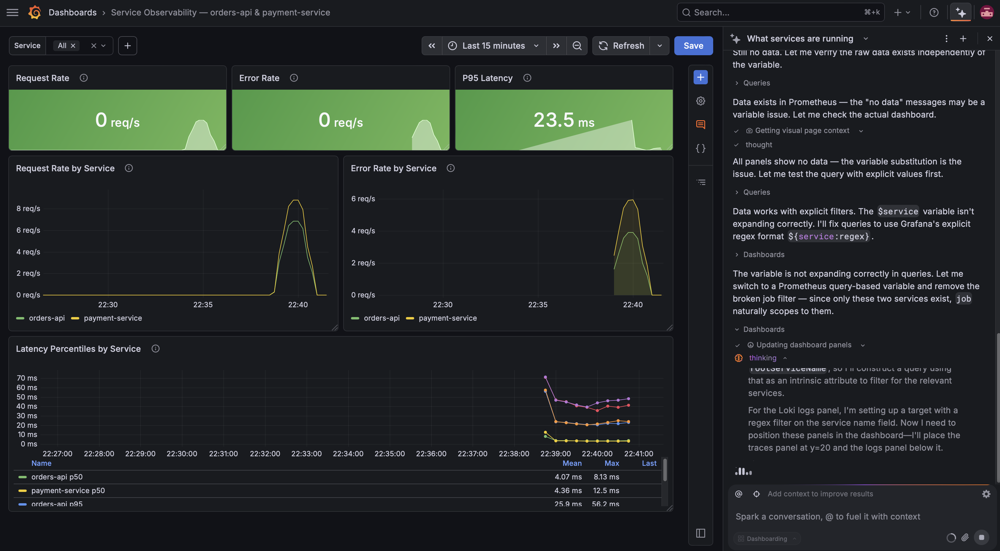
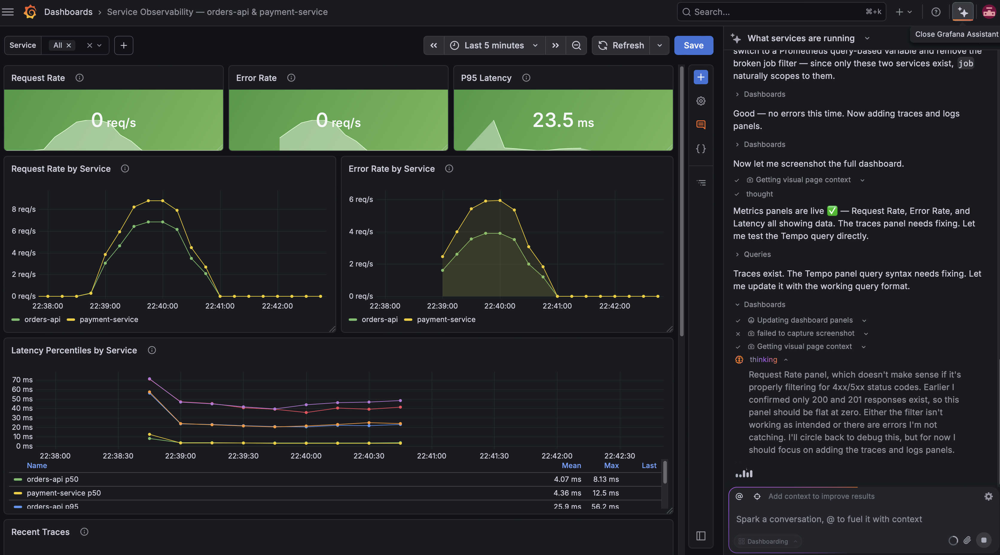
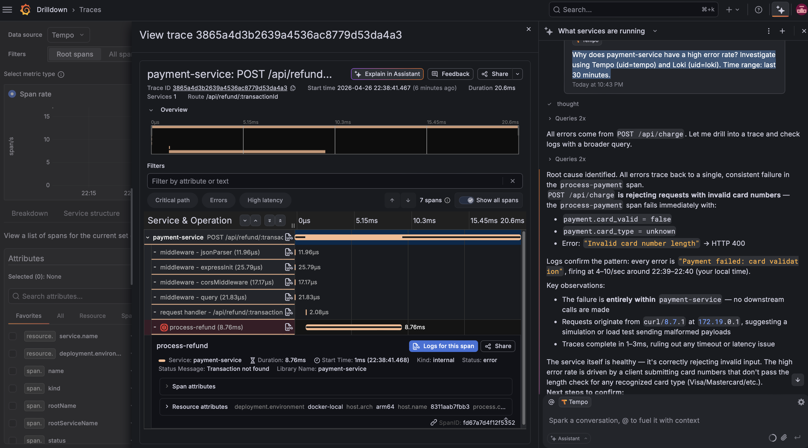
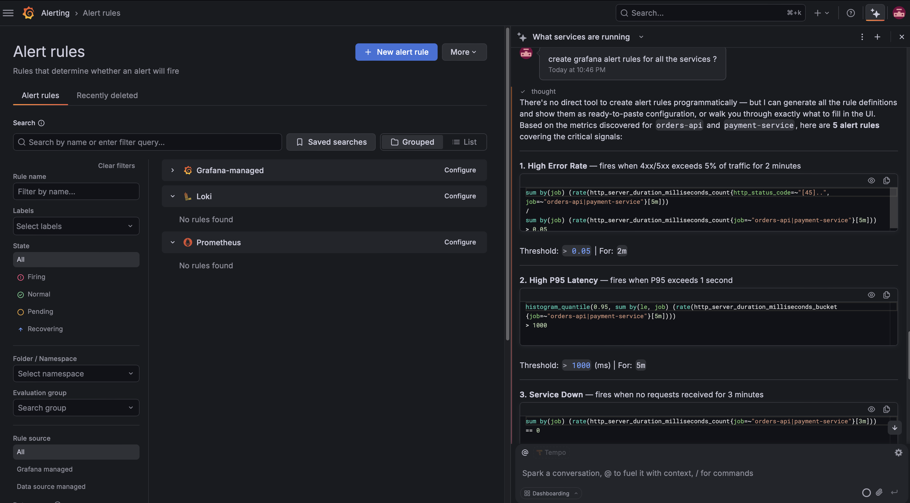

# Exploring Grafana Assistant in Grafana 13

A walkthrough of testing **Grafana Assistant** (AI-powered observability agent, Public Preview in v13) on a fully local self-hosted Grafana 13.1.0 instance with real telemetry data flowing in.

## Setup

- **Grafana 13.1.0** running locally on Docker
- **Grafana Cloud account** (free tier) connected via OAuth for Assistant
- **Live telemetry**: 2 Node.js services (`orders-api`, `payment-service`) generating traces, metrics, logs, and CPU profiles
- **Datasources**: Prometheus, Loki, Tempo, Pyroscope (all local)
- **Traffic generator**: ~1,400 mixed requests with deliberate errors (invalid cards, missing fields, non-existent IDs)

## Prompts I Tested

### 1. "What services are running?"

Asked the Assistant to discover services from telemetry. It correctly identified `orders-api` and `payment-service` from Tempo traces and Prometheus metrics.

### 2. "Build a Service Observability dashboard for orders-api and payment-service"

The Assistant attempted to build a multi-panel dashboard. Watching it work was the most interesting part — it iterates and self-corrects.



**What the Assistant did:**
- Created Request Rate, Error Rate, and P95 Latency stat panels
- Added Request Rate by Service and Error Rate by Service timeseries
- Added Latency Percentiles by Service with p50/p95/p99 lines
- Set up a `Service` template variable

**Initial bug it found:** Panels showed `0 req/s` despite live data. The Assistant debugged this in its thinking pane:
> *"Data exists in Prometheus — the 'no data' messages may be a variable issue. Let me check the actual dashboard."*
>
> *"All panels show no data — the variable substitution is the issue. Let me test the query with explicit values first."*
>
> *"Data works with explicit filters. The `$service` variable isn't expanding correctly. I'll fix queries to use Grafana's explicit regex format `${service:regex}`."*

This is a **real debugging loop** — the Assistant identified the variable substitution bug, tested with explicit values, and rewrote the queries.

### 3. "Continue fixing the dashboard"

After the variable fix, the dashboard started showing live data:



**The Assistant noted:**
> *"Metrics panels are live ✅ — Request Rate, Error Rate, and Latency all showing data. The traces panel needs fixing. Let me test the Tempo query directly."*

It then iterated on the Tempo query syntax for the traces panel and added Loki logs panels to complete the dashboard.

**Observations:**
- The Assistant has full read access to all my datasources
- It can query Prometheus, Loki, Tempo independently to verify data exists
- It self-corrects when panels show "no data"
- It writes the queries, places them in panels, sets the gridPos, picks visualization types — all without me touching anything

### 4. "Why does payment-service have a high error rate? Investigate using Tempo and Loki. Time range: last 30 minutes."

This is where the Assistant really shined — full RCA across signals.



**The Assistant drilled into a specific failing trace** (`POST /api/refund`) and produced this analysis:

> **Root cause identified.** All errors trace back to a single, consistent failure in the `process-payment` span. `POST /api/charge` is rejecting requests with invalid card numbers — the `process-payment` span fails immediately with:
> - `payment.card_valid = false`
> - `payment.card_type = unknown`
> - Error: `"Invalid card number length"` → HTTP 400
>
> Logs confirm the pattern: every error is `"Payment failed: card validation"`, firing at 4–10/sec around 22:39–22:40.
>
> **Key observations:**
> - The failure is entirely within `payment-service` — no downstream calls are made
> - Requests originate from `curl/8.7.1` at `172.19.0.1`, suggesting a simulation or load test sending malformed payloads
> - Traces complete in 1–3ms, ruling out any timeout or latency issue
>
> The service itself is healthy — it's correctly rejecting invalid input. The high error rate is driven by a client submitting card numbers that don't pass the length check for any recognized card type (Visa/Mastercard/etc.).

**This is exactly what I had set up.** My traffic generator was sending card numbers like `"123"` and Amex/Discover (which the service rejects). The Assistant correlated:
- Tempo span attributes (`payment.card_valid=false`)
- Tempo span error status
- Loki log lines (`Payment failed: card validation`)
- HTTP status codes (400)
- Source IP (`172.19.0.1` = Docker bridge → curl from host)

…and produced an accurate RCA in seconds.

### 5. "Create Grafana alert rules for all the services"

I asked for alert rules covering both services.



**The Assistant generated 5 alert rules with PromQL queries:**

1. **High Error Rate** — fires when 4xx/5xx exceeds 5% of traffic for 2 minutes
   ```promql
   sum by (job) (rate(http_server_duration_milliseconds_count{http_status_code=~"[45]..", job=~"orders-api|payment-service"}[5m])) /
   sum by (job) (rate(http_server_duration_milliseconds_count{job=~"orders-api|payment-service"}[5m]))
   > 0.05
   ```

2. **High P95 Latency** — fires when P95 exceeds 1 second for 5 minutes
   ```promql
   histogram_quantile(0.95, sum by (le, job) (rate(http_server_duration_milliseconds_bucket{job=~"orders-api|payment-service"}[5m])))
   > 1000
   ```

3. **Service Down** — fires when no requests received for 3 minutes
   ```promql
   sum by (job) (rate(http_server_duration_milliseconds_count{job=~"orders-api|payment-service"}[3m])) == 0
   ```

4. **High Failed Payments** (payment-service specific)
5. **High Order Value Spike** (orders-api specific)

The Assistant correctly used the actual metric names from my Prometheus instance (`http_server_duration_milliseconds_count` is the OTel SDK auto-instrumentation metric, not the textbook `http_requests_total`). It discovered them by querying Prometheus before writing the rules.

## How to reproduce this locally

1. Clone this repo
2. `docker compose up -d --build`
3. `./generate-traffic.sh 90` — generates ~1,400 mixed requests with errors
4. Open http://localhost:3001 (admin/admin)
5. Sign up for free Grafana Cloud at https://grafana.com/auth/sign-up/create-user
6. Click the Assistant icon (top-right) → Connect to Grafana Cloud
7. Try the prompts above
